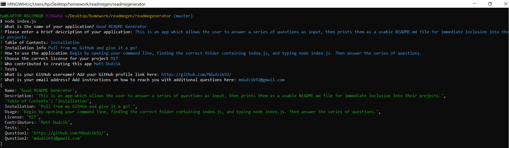

* Good README Generator

<!-- Live link to deployed app -->
Repository: https://github.com/Mdudzik92/readmegenerator/  
Deployed app: https://mdudzik92.github.io/readmegenerator/

<!-- Technologies used -->
Node.js, Javascript, JSON

<!-- Explanation of what the app is -->
This is an app which allows the user to answer a series of questions as input, then prints them as a usable README.md file for immediate inclusion into their projects.

<!-- Screenshot -->

<!-- License -->
MIT

<!-- Contact information -->
Email: mdudzik92@gmail.com